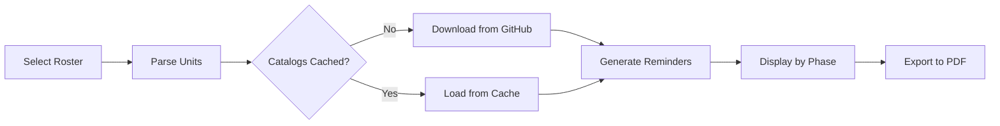

# Warhammer 40K Roster Reminders

A GUI application for generating phase-based tactical reminders from BattleScribe roster files for Warhammer 40,000 10th Edition. Never forget your army abilities during a game again!


## ✨ Features

### Core Functionality

- 🎮 **Graphical User Interface** - Easy-to-use desktop application
- 📋 **Roster File Support** - Reads BattleScribe .ros and .rosz files
- 📦 **Automatic Catalog Downloads** - Fetches army data from BSData GitHub repository
- 🔄 **Smart Caching** - Downloads once, uses offline thereafter
- 🔍 **Auto-Update Checks** - Checks for catalog updates every 7 days
- 🎯 **Phase Organization** - Reminders sorted by game phase
- 📑 **PDF Export** - Print-ready documents for games
- 🏆 **Detachment Support** - Includes detachment-specific rules and bonuses

### Smart Deduplication

- **Army-wide rules** (like Oath of Moment) shown once at the top
- **Detachment rules** (like Combat Doctrines) displayed separately
- **Unit-specific abilities** clearly marked per unit
- **No duplicate information** - clean, concise output

### User Experience

- ✅ First-run setup guidance
- ✅ Progress indicators for long operations
- ✅ Offline mode with cached catalogs
- ✅ Unit composition grouping (sergeants with squads)
- ✅ Threaded operations - UI stays responsive

## 📥 Download & Installation

### Option 1: Download Pre-Built Executable (Recommended)

1. Go to the [Releases](https://github.com/YOUR_USERNAME/40KReminders/releases) page
2. Download the latest `WH40K_Roster_Reminders_Windows.zip`
3. Extract the ZIP file
4. Run `WH40K_Roster_Reminders.exe`

**Note:** Keep the `catalog_cache` folder next to the .exe file!

### Option 2: Run from Source

Requirements:

- Python 3.11 or higher
- pip (Python package manager)

```bash
# Clone the repository
git clone https://github.com/YOUR_USERNAME/40KReminders.git
cd 40KReminders

# Install dependencies
pip install -r requirements.txt

# Run the application
python gui.py
```

## 🚀 Quick Start

### GUI Mode (Recommended)

1. **Launch the application**

   ```bash
   python gui.py
   ```

   (Or double-click `WH40K_Roster_Reminders.exe`)

2. **Select your roster**

   - Click **"Browse..."**
   - Navigate to your BattleScribe roster file (.ros or .rosz)
   - Select the file

3. **Process roster**

   - Click **"Process Roster"**
   - The app will:
     - Parse your roster
     - Download necessary catalogs (first time only)
     - Generate phase-organized reminders
     - Display results in the output window

4. **Export to PDF** (optional)
   - Click **"Export to PDF"**
   - Choose save location
   - Use the PDF during your game!

### Command Line Mode

For advanced users or scripting:

**Process a roster:**

```bash
python reminders.py your_army.rosz
```

**Look up a specific unit:**

```bash
python reminders.py "Imperium - Space Marines" "Intercessor Squad"
```

**Include detachment:**

```bash
python reminders.py "Imperium - Space Marines" "Intercessor Squad" "Gladius Task Force"
```

## 📖 How It Works



### The Process

1. **Roster Parsing** - Extracts units, equipment, and detachment from your roster
2. **Catalog Download** - Fetches army-specific rules from BSData/wh40k-10e
3. **Rule Resolution** - Resolves abilities through infoLinks across catalogs
4. **Phase Categorization** - Organizes abilities by when they're used
5. **Deduplication** - Separates army-wide, detachment, and unit-specific rules
6. **PDF Generation** - Creates a clean, formatted document

### Cache Management

- **Location**: `catalog_cache/` folder next to the application
- **First Run**: Downloads catalogs as needed (~2-5 MB per army)
- **Subsequent Runs**: Uses cached files instantly
- **Update Check**: Every 7 days, checks GitHub for updates
- **Offline Mode**: Works perfectly with cached catalogs

## 📊 Output Format

### On-Screen Display

```
======================================================================
ROSTER REMINDERS
DETACHMENT: Gladius Task Force
======================================================================

ARMY-WIDE RULES
──────────────────────────────────────────────────────────────────────

  📍 COMMAND PHASE
    🔹 Oath of Moment: Select one enemy unit...
    🔷 Combat Doctrines: Select Devastator, Tactical, or Assault...

======================================================================

──────────────────────────────────────────────────────────────────────
📋 Intercessor Squad
   └─ 4x Intercessor, Intercessor Sergeant
──────────────────────────────────────────────────────────────────────
  📌 Passive: Objective Secured
```

**Icons:**

- 🔹 Army-wide rules (all units)
- 🔷 Detachment rules (all units in detachment)
- ⚡ Unit-specific abilities (this unit only)
- 📌 Passive abilities (always active)

### PDF Export

- **Title Page** with army name, detachment, and date
- **Army-Wide Rules Section** (shown once)
- **Unit Sections** with:
  - Unit name and composition
  - Phase-organized abilities
  - Passive abilities summary
- **Clean formatting** for easy reading during games

## 🎯 Supported Armies

All 40K 10th Edition armies from [BSData/wh40k-10e](https://github.com/BSData/wh40k-10e):

- Adeptus Custodes
- Adeptus Mechanicus
- Aeldari
- Astra Militarum
- Chaos Daemons
- Chaos Knights
- Chaos Space Marines
- Death Guard
- Drukhari
- Genestealer Cults
- Grey Knights
- Imperial Knights
- Leagues of Votann
- Necrons
- Orks
- Space Marines (all chapters)
- T'au Empire
- Thousand Sons
- Tyranids
- World Eaters
- And more!

## 📁 Project Structure

```
40KReminders/
├── gui.py                  # GUI application
├── reminders.py            # Core reminder engine
├── rosterParser.py         # Roster file parser
├── catalog_manager.py      # Catalog downloader with update checking
├── catConvert.py           # XML to JSON converter
├── requirements.txt        # Python dependencies
├── build.ps1               # Build script (for development)
├── build_spec.spec         # PyInstaller configuration
├── test_build_ready.py     # Pre-build validation
├── catalog_cache/          # Downloaded catalogs (auto-created)
└── .github/
    └── workflows/
        └── build.yml       # Automated builds via GitHub Actions
```

## 🔧 Technical Details

### Dependencies

- **requests** - Downloads catalogs from GitHub
- **fpdf2** - PDF generation
- **tkinter** - GUI framework (included with Python)
- **xml.etree.ElementTree** - XML parsing (Python standard library)

### Catalog Sources

Catalogs are downloaded from the official BattleScribe Data repository:

- Repository: [BSData/wh40k-10e](https://github.com/BSData/wh40k-10e)
- Format: XML (.cat files) converted to JSON
- Game System: Warhammer 40,000.gst

### Cache Structure

```
catalog_cache/
├── version_info.json       # Last update check timestamp
├── Warhammer 40,000.json   # Game system file
├── Imperium - Space Marines.json
├── Imperium - Space Wolves.json
└── ... (more armies)
```

## 🐛 Troubleshooting

### "Could not find unit"

- **Cause**: Unit name mismatch or missing catalog
- **Solution**: Ensure roster is from 10th Edition and catalog is downloaded

### "Catalog not found"

- **Cause**: First run without internet
- **Solution**: Connect to internet for initial catalog download

### PDF Won't Export

- **Cause**: Permission issues or special characters
- **Solution**: Save to a different location, check file permissions

### Update Check Fails

- **Cause**: No internet connection or GitHub rate limiting
- **Solution**: App will use cached catalogs automatically

### GUI Won't Start

- **Cause**: Missing tkinter or Python version mismatch
- **Solution**: Ensure Python 3.11+ and tkinter is installed

## 🔒 Privacy & Security

- **No data collection** - Everything runs locally
- **No account required** - No sign-ups or logins
- **Open source** - Review the code yourself
- **GitHub only** - Downloads only from official BSData repository

## 🤝 Contributing

Contributions are welcome! Areas for improvement:

- Additional army-specific formatting
- More phase detection keywords
- UI/UX enhancements
- Bug fixes and optimizations

## 🏗️ Building from Source

Automated builds via GitHub Actions create releases automatically. See [BUILD.md](BUILD.md) for details on local building (requires Python 3.11).

### Quick Build

```bash
# Install PyInstaller
pip install pyinstaller

# Build executable
powershell -ExecutionPolicy Bypass -File build.ps1
```

## 📜 License

This project is open source. BattleScribe catalog data is provided by [BSData](https://github.com/BSData) under their respective licenses.

## 🙏 Acknowledgments

- **BSData Team** - For maintaining the excellent BattleScribe data files
- **Games Workshop** - For Warhammer 40,000
- **BattleScribe** - For the roster management application

## 📞 Support

- **Issues**: Report bugs via [GitHub Issues](https://github.com/YOUR_USERNAME/40KReminders/issues)
- **Questions**: Check existing issues or open a new one
- **Updates**: Watch the repository for new releases

---

**Made with ❤️ for the Warhammer 40K community**

_"In the grim darkness of the far future, there is only... well-organized tactical reminders!"_
